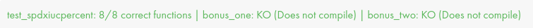

*This project has been created as part of the 42 curriculum by hyunlee.*

# ft_printf

## Result

<p align="center">
  
</p>
<p align="center">
  
</p>

## Description
ft_printf is a custom recreation of the C standard library's `printf` function for the 42 curriculum. The goal of the project is to understand variadic arguments and implement formatted output while following the project's constraints.

The library builds into `libftprintf.a` and supports the mandatory conversions: `%c`, `%s`, `%p`, `%d`, `%i`, `%u`, `%x`, `%X`, and `%%`.

### Implementation Notes

The format string is processed in a single traversal. When a `%` sequence is found, the next character is routed to the matching conversion function, and the printed byte count is returned back to `ft_printf`.

Unsigned, hexadecimal, and pointer values are printed with recursive base conversion. This avoids extra buffers while preserving the correct digit order.

Null strings are printed as `(null)`, and null pointers are printed as `(nil)` to match the expected glibc behavior used by the project testers.

## Instructions
Build the library:

```sh
make
```

Clean object files:

```sh
make clean
```

Remove object files and the static library:

```sh
make fclean
```

Rebuild from scratch:

```sh
make re
```

## Resources
- Linux manual pages: `man 3 printf`, `man 3 stdarg`
- Tester: https://github.com/Leehyunbin0131/printfTester
- My Notion study notes: https://coconut-munchkin-952.notion.site/2026_42gs-79872d44d901462c8b583fa5b48e7f03

AI assistance was used during the learning and debugging process. Google's Gemini model was used to study variadic arguments, discuss project structure for Norminette constraints, and analyze debugging output without generating or copy-pasting the implementation code.
